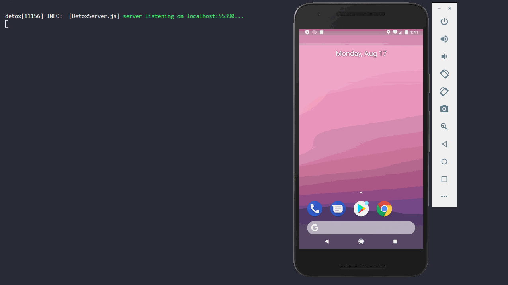

# react-native-testes-e2e

Projeto react native de exemplo que implementa testes end to end (E2E).



## Como começar

Primeiramente é necessario fazer o clone do repositório, e seguir as
instruções de instalação.

### Instalação

Ao fazer o clone do projeto realize as instalações seguintes.

Para instalar as dependencias do projeto execute no prompt de comando

```sh
npm install
```

E para instalar o detox globalmente

```sh
npm install -g detox-cli
```

Defina o nome do emulador android que está instalado em sua maquina

```json
// package.json
"detox": {
    "testRunner": "mocha",
    "runnerConfig": "e2e/.mocharc.json",
    "configurations": {
      "android.emu.debug": {
        "binaryPath": "android/app/build/outputs/apk/debug/app-debug.apk",
        "build": "cd android && gradlew assembleDebug assembleAndroidTest -DtestBuildType=debug && cd ..",
        "type": "android.emulator",
        "device": {
          "avdName": "NOME_EMULADOR" // AQUI
        }
      },
      "android.emu.release": {
        "binaryPath": "android/app/build/outputs/apk/release/app-release.apk",
        "build": "cd android && gradlew assembleRelease assembleAndroidTest -DtestBuildType=release && cd ..",
        "type": "android.emulator",
        "device": {
          "avdName": "NOME_EMULADOR" // AQUI
        }
      }
    }
```

## Rodandos os testes

Vamos rodar os testes automatizados para este sistema.

### Testes end to end

Execute o comando no prompt de comando.

```sh
npm run e2e:ci
```

### Links de documentações

- [End to End Testing with Detox on React-Native](https://dev.to/jeevankishore/e2e-detox-react-native-161o)
- [Detox Getting Started](https://github.com/wix/Detox/blob/master/docs/Introduction.GettingStarted.md)
- [Detox for Android](https://github.com/wix/Detox/blob/master/docs/Introduction.Android.md)
